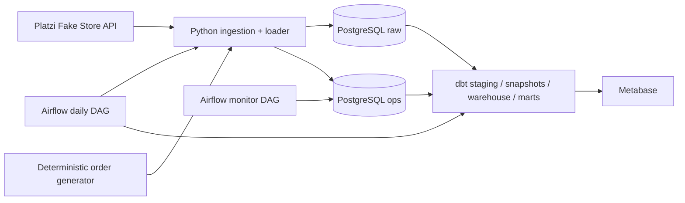

# E-commerce API-to-Warehouse Data Platform

Nền tảng Data Engineering batch end-to-end cho dữ liệu thương mại điện tử. Project lấy catalog từ Platzi Fake Store API, sinh đơn hàng synthetic có tính quyết định, nạp vào PostgreSQL, chuẩn hóa bằng dbt, điều phối bằng Apache Airflow và cung cấp lớp báo cáo cho Metabase.

> **Trạng thái:** runnable MVP, có Docker Compose, Airflow DAG, monitor, dbt warehouse/marts, data quality tests, least-privilege database roles, CI và tài liệu vận hành.

## Mục lục

- [Tổng quan](#tổng-quan)
- [Kiến trúc](#kiến-trúc)
- [Quick start](#quick-start)
- [Vận hành pipeline](#vận-hành-pipeline)
- [dbt targets](#dbt-targets)
- [Metabase](#metabase)
- [Kiểm thử và CI](#kiểm-thử-và-ci)
- [Troubleshooting](#troubleshooting)
- [Bảo mật](#bảo-mật)
- [Cấu trúc repository](#cấu-trúc-repository)
- [CV và portfolio](#cv-và-portfolio)

## Tổng quan

### Bài toán

Project mô phỏng một pipeline analytics production-oriented có các yêu cầu:

- ingest catalog API với pagination, timeout, retry/backoff và validation;
- lưu dữ liệu nguồn và audit metadata trong PostgreSQL;
- sinh đơn hàng synthetic theo business date và seed cố định;
- bảo đảm retry không tạo duplicate order hoặc duplicate audit row;
- xây dựng staging, warehouse, snapshot và marts bằng dbt;
- chạy daily pipeline lúc `02:00 UTC` và monitor mỗi 15 phút;
- giới hạn quyền database theo vai trò ingestion, transformation và BI;
- kiểm tra data quality bằng pytest và dbt tests;
- cung cấp dashboard-ready schemas cho Metabase.

### Stack

| Thành phần | Công nghệ |
|---|---|
| Runtime | Python 3.12+, Docker Compose |
| Source | Platzi Fake Store API + deterministic synthetic orders |
| Storage | PostgreSQL 17 |
| Transformation | dbt Core 1.11 với `dbt-postgres` |
| Orchestration | Apache Airflow 3.3, `LocalExecutor` |
| BI | Metabase 0.58 |
| Quality | pytest, dbt data tests, Ruff |
| Automation | GitHub Actions |

### Kết quả E2E tham chiếu

Một lần chạy production đã được kiểm tra thành công với các số liệu tham chiếu:

- `90` orders;
- `312` order lines;
- `180,024.00` USD gross revenue;
- `56` rows trong `marts.mart_customer_sales`;
- `163` rows trong `marts.mart_product_sales`;
- top-customer chart có `10` dòng và `0` lỗi thứ tự giảm dần.

Các con số trên là evidence của lần chạy tham chiếu, không phải dữ liệu cố định mà mọi lần chạy mới phải giống hệt.

## Kiến trúc



Mô tả chi tiết:

- [`docs/current-architecture.md`](docs/current-architecture.md) — kiến trúc hiện trạng, lineage, idempotency và phân quyền.
- [`docs/data-model.md`](docs/data-model.md) — grain, khóa, schema và metric contract.
- [`docs/operations-runbook.md`](docs/operations-runbook.md) — hướng dẫn vận hành và khôi phục.
- [`dashboards/executive-overview.md`](dashboards/executive-overview.md) — specification để tái tạo dashboard mà không cần commit Metabase metadata.

## Quick start

### Prerequisites

Cài đặt trước:

- Git;
- Docker Desktop với Docker Compose v2;
- Python 3.12+ trên host nếu muốn chạy lint/test/bootstrap;
- GNU Make nếu muốn dùng các shortcut `make` (trên Windows có thể dùng Git Bash/WSL hoặc chạy lệnh Docker/Python trực tiếp).

Docker cần được bật và cấp quyền cho thư mục project. Pipeline ingestion cần kết nối Internet tới Platzi API.

### 1. Clone và tạo environment local

```bash
git clone https://github.com/D121104/ecommerce-data-platform.git
cd ecommerce-data-platform
python scripts/bootstrap.py
```

[`scripts/bootstrap.py`](scripts/bootstrap.py:1) tạo `.env` local từ [`.env.example`](.env.example:1), sinh credential ngẫu nhiên cho local và không in secret ra terminal. `.env` đã được ignore; không commit hoặc gửi file này.

Nếu `.env` đã tồn tại, script không ghi đè. Hãy mở `.env` local và kiểm tra các setting không nhạy cảm:

```text
DBT_TARGET=prod
DBT_SCHEMA=analytics
POSTGRES_PORT=5433
AIRFLOW_API_PORT=8080
METABASE_PORT=3000
```

Target `prod` ở local là chủ ý: dbt ghi vào các schema ổn định `staging`, `warehouse`, `marts` để Metabase đọc cùng một contract. Khi cần cô lập môi trường phát triển, đổi thành:

```text
DBT_TARGET=dev
DBT_SCHEMA=dbt_dev
```

### 2. Validate trước khi khởi động

```bash
python scripts/validate_repository.py
python scripts/security_scan.py
docker compose config --quiet
```

Các lệnh trên không in giá trị secret. `security_scan.py` chỉ quét high-confidence patterns trên tracked files.

### 3. Khởi động platform

```bash
docker compose up -d --build --wait
docker compose ps
```

Hoặc dùng Make:

```bash
make db-up
make status
```

`airflow-init` tự migrate metadata database, tạo Airflow admin user và tạo password file trong named volume `airflow_auth`. Clone mới không cần có file `airflow/simple_auth_manager_passwords.json` trong repository.

Các URL local mặc định:

| Service | URL | Credential |
|---|---|---|
| Airflow | http://localhost:8080 | `AIRFLOW_ADMIN_USERNAME` và `AIRFLOW_ADMIN_PASSWORD` trong `.env` |
| Metabase | http://localhost:3000 | Tài khoản tạo ở lần setup Metabase đầu tiên |
| PostgreSQL | `localhost:5433` | Role tương ứng trong `.env` |

Đọc log khi cần:

```bash
docker compose logs -f --tail=100
docker compose logs -f airflow-init airflow-api-server airflow-scheduler
```

### 4. Tạo data source trong Metabase

Metabase dùng PostgreSQL application database riêng (`metabase`) nhưng data source analytics trỏ tới database `ecommerce`:

| Setting | Value |
|---|---|
| Host khi Metabase chạy trong Compose | `postgres` |
| Port | `5432` |
| Database | `ecommerce` |
| User | Giá trị `BI_DB_USER` trong `.env` |
| Password | Giá trị `BI_DB_PASSWORD` trong `.env` |
| Schema | `marts` |
| SSL | Disable cho local Compose |

Role BI chỉ được cấp quyền đọc trên `marts`. Không dùng `platform_admin` cho Metabase.

## Vận hành pipeline

### Airflow DAGs

| DAG | Schedule | Vai trò |
|---|---:|---|
| `ecommerce_daily_pipeline` | `0 2 * * *` UTC | Ingest catalog, validate raw, generate orders, snapshot, dbt run/test, finalize audit |
| `ecommerce_pipeline_monitor` | `*/15 * * * *` UTC | Phát hiện failed, running quá lâu, stale hoặc thiếu daily run |

DAG được pause khi tạo theo cấu hình an toàn. Có thể unpause và trigger trong Airflow UI, hoặc dùng CLI:

```bash
docker compose exec airflow-api-server airflow dags list
docker compose exec airflow-api-server airflow dags unpause ecommerce_daily_pipeline
docker compose exec airflow-api-server airflow dags unpause ecommerce_pipeline_monitor
docker compose exec airflow-api-server airflow dags trigger ecommerce_daily_pipeline
```

Shortcut tương đương:

```bash
make airflow-list
make airflow-trigger
make monitor-trigger
```

Pipeline audit dùng batch ID UUID5 ổn định từ Airflow `run_id`, nên retry cùng một run không tạo thêm row audit. Failure callback có fallback upsert vào `ops.pipeline_runs` nếu task bị kill trước khi task audit đầu tiên kịp insert.

### Kiểm tra audit và dữ liệu marts

Lệnh dưới đây chạy trong PostgreSQL container và chỉ trả về metadata/counts:

```bash
docker compose exec postgres psql \
  -U platform_admin \
  -d ecommerce \
  -c "
    SELECT pipeline_name, status, started_at, finished_at,
           records_inserted, records_updated, records_rejected
    FROM ops.pipeline_runs
    ORDER BY started_at DESC
    LIMIT 10;
  "
```

```bash
docker compose exec postgres psql \
  -U platform_admin \
  -d ecommerce \
  -c "
    SELECT
      (SELECT count(*) FROM warehouse.fct_orders) AS orders,
      (SELECT count(*) FROM warehouse.fct_order_items) AS order_lines,
      (SELECT count(*) FROM marts.mart_customer_sales) AS customer_rows,
      (SELECT count(*) FROM marts.mart_product_sales) AS product_rows;
  "
```

Nếu đổi role/database trong `.env`, thay `platform_admin` và `ecommerce` trong ví dụ bằng giá trị local tương ứng.

### Chạy ingestion và order generator thủ công

Các CLI được cài trong Airflow image:

```bash
docker compose exec airflow-api-server bash -lc \
  'ingest-platzi --help'

docker compose exec airflow-api-server bash -lc \
  'generate-orders --help'
```

Không chạy order generator cùng business date nhiều lần với seed khác nhau nếu muốn giữ tính quyết định và truy vết. Pipeline chính quản lý logical date, batch ID và thứ tự các bước.

## dbt targets

Profile [`dbt/ecommerce_dw/profiles.yml`](dbt/ecommerce_dw/profiles.yml:1) chọn target qua `DBT_TARGET`.

| Target | Schema kết quả | Mục đích |
|---|---|---|
| `dev` | `dbt_dev_staging`, `dbt_dev_warehouse`, `dbt_dev_marts` nếu `DBT_SCHEMA=dbt_dev` | Phát triển/cô lập |
| `ci` | Schema CI theo `DBT_SCHEMA` | GitHub Actions |
| `prod` | `staging`, `warehouse`, `marts` | Contract ổn định cho BI |

Các lệnh sau chạy trong `airflow-api-server` và tự đọc target từ environment container:

```bash
make dbt-debug
make dbt-snapshot
make dbt-run
make dbt-test
make dbt-build
```

`dbt build` gồm model build và tests theo dependency graph. DAG production chạy theo thứ tự `snapshot` → `run` → `test` → audit success.

## Metabase

Metabase dashboard metadata được lưu trong application database volume, không phải file source-controlled. Đây là đặc điểm runtime của Metabase, không phải dấu hiệu thiếu dữ liệu trong marts.

Để project cloneable và reviewable:

- dashboard specification, source schema, metric definition và query quan trọng được lưu trong [`dashboards/executive-overview.md`](dashboards/executive-overview.md);
- credentials/data source không được lưu trong Git;
- ảnh evidence public-safe nằm trong [`docs/assets/`](docs/assets/README.md);
- khi chia sẻ portfolio, chụp lại UI sau khi cấu hình data source local và che URL/token nếu có.

Card Top Customers dùng aggregate rõ ràng theo `customer_id` + `customer_name`, filter `USD`, sort tổng doanh thu giảm dần và limit 10. Việc thêm `customer_label` tránh gộp nhầm các user có cùng display name.

## Kiểm thử và CI

### Host checks

```bash
python scripts/validate_repository.py
python scripts/security_scan.py
ruff check src tests scripts
pytest -m "not integration"
```

Hoặc:

```bash
make install
make lint
make test
make validate
```

Integration test cần PostgreSQL có schema/role phù hợp:

```bash
pytest -m integration
```

### CI workflow

[`.github/workflows/dbt-ci.yml`](.github/workflows/dbt-ci.yml:1) thực hiện:

1. validate repository, secret patterns, Compose interpolation và cả bốn SQL init scripts;
2. tạo Airflow secrets ephemeral cho job, không phụ thuộc secret local;
3. dựng PostgreSQL/Airflow bằng Compose;
4. cài package, chạy Ruff và unit tests;
5. seed fixture deterministic và generate orders;
6. chạy `dbt debug` và `dbt build` trên target `dev`;
7. upload dbt artifacts khi cần debug;
8. cleanup bằng `docker compose down -v`.

## Troubleshooting

### Docker Compose báo thiếu biến môi trường

Chạy lại:

```bash
python scripts/bootstrap.py
docker compose config --quiet
```

Không copy password thật vào `docker-compose.yml`; mọi giá trị runtime phải đến từ `.env` hoặc CI environment.

### Airflow không mở được hoặc `airflow-db` không resolve

Kiểm tra:

```bash
docker compose ps
docker compose logs airflow-db airflow-init airflow-api-server
```

Đảm bảo `airflow-db` healthy trước các service Airflow. Sau khi sửa `.env`, recreate service:

```bash
docker compose up -d --build --force-recreate --wait
```

### Airflow auth file bị lỗi sau khi đổi cấu hình

Auth file nằm trong named volume. Re-run init trước:

```bash
docker compose run --rm airflow-init
docker compose up -d --wait
```

Nếu muốn reset toàn bộ local state, dùng [reset command](#reset-dữ-liệu-local) bên dưới.

### Metabase không thấy dữ liệu daily mới

Kiểm tra target và schema:

```bash
docker compose exec airflow-api-server bash -lc 'env | grep "^DBT_"'
```

Local dashboard phải đọc `marts`, không phải các schema dev. Với runtime dashboard, dùng `DBT_TARGET=prod` và `DBT_SCHEMA=analytics`, sau đó:

```bash
docker compose up -d --force-recreate airflow-init airflow-api-server airflow-scheduler airflow-dag-processor
make airflow-trigger
```

### dbt build fail do schema/permission

Kiểm tra:

```bash
make dbt-debug
docker compose exec postgres psql \
  -U platform_admin -d ecommerce \
  -c "SELECT current_user, current_database();"
```

Không cấp quyền admin cho `dbt_user`; sửa đúng init script hoặc recreate database volume nếu cần apply init script từ đầu.

### SQL init script thay đổi nhưng database không thay đổi

PostgreSQL image chỉ chạy `/docker-entrypoint-initdb.d` khi data volume mới. Đây là hành vi bình thường. Với local disposable data:

```bash
# Destructive: xóa dữ liệu PostgreSQL, Airflow metadata và Metabase metadata.
docker compose down -v
docker compose up -d --build --wait
```

### Reset dữ liệu local

```bash
make db-reset
make db-up
```

`make db-reset` là destructive và không dùng trong môi trường có dữ liệu cần giữ.

## Bảo mật

- Không commit `.env`, password file, webhook URL, API key, token hoặc database dump.
- Chỉ commit [`.env.example`](.env.example:1) với placeholder.
- `scripts/bootstrap.py` sinh credential local bằng `secrets` và không in giá trị ra log.
- `bi_reader` chỉ đọc `marts`; Metabase không dùng admin role.
- `raw.users` có constraint không cho lưu `password` trong payload.
- Webhook alert để trống mặc định; alert vẫn được ghi vào `ops.pipeline_alerts`.
- Trước khi publish screenshot, che host nội bộ, email nhạy cảm, token, cookie và query parameter chứa credential.
- Nếu credential từng xuất hiện trong local history hoặc log public, rotate credential trước khi push.

## Cấu trúc repository

```text
.
├── airflow/
│   ├── dags/                         # daily pipeline và monitor DAG
│   └── Dockerfile                    # Airflow + package + dbt runtime
├── dbt/ecommerce_dw/
│   ├── models/staging/               # cleaned source models
│   ├── models/warehouse/             # dimensions và fct_orders/fct_order_items
│   ├── models/marts/                 # BI marts
│   ├── snapshots/                    # SCD history location
│   ├── tests/                        # singular dbt tests
│   └── profiles.yml                  # dev/ci/prod target
├── dashboards/                       # dashboard specifications, không chứa secrets
├── docs/                             # architecture, model, runbook, portfolio, evidence
├── scripts/                          # bootstrap, repository validation, secret scan
├── sql/init/                         # roles, schemas, raw/ops/monitoring objects
├── src/ecommerce_pipeline/           # Python API client, loader, generator, validation
├── tests/                            # unit, integration và deterministic fixtures
├── docker-compose.yml
├── Makefile
└── pyproject.toml
```

## CV và portfolio

Nội dung đã chuẩn bị sẵn trong [`docs/cv-portfolio.md`](docs/cv-portfolio.md). Vai trò cá nhân được mô tả theo deliverable có thể kiểm chứng: ingestion, raw/ops contract, dbt warehouse/marts, Airflow orchestration/monitoring, least privilege, Metabase specification và CI.

Generated reference evidence cards (không phải screenshot UI và không chứa credential):

- [`airflow-dag-success.svg`](docs/assets/airflow-dag-success.svg)
- [`dbt-build-success.svg`](docs/assets/dbt-build-success.svg)
- [`metabase-executive-overview.svg`](docs/assets/metabase-executive-overview.svg)

## License / portfolio note

Project dùng Platzi Fake Store API cho mục đích học tập và portfolio. Synthetic orders không đại diện cho dữ liệu khách hàng thật. Hãy kiểm tra điều khoản của source API trước khi dùng trong môi trường thương mại.
