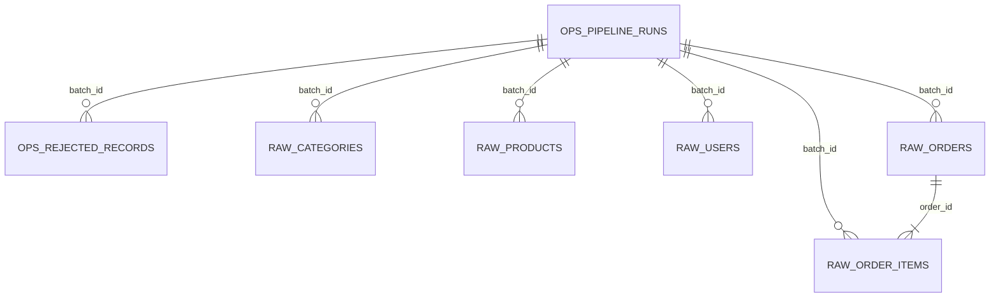

# Cấu trúc raw/ops PostgreSQL — Schema Reference

> Tài liệu này tập trung vào raw/ops tables được khai báo trong SQL init. Nó không phải catalog đầy đủ của dbt staging, warehouse, marts hoặc Metabase. Xem [data model](data-model.md) cho contract end-to-end và [current architecture](current-architecture.md) cho lineage/runtime.

**Nguồn trích xuất:** [`sql/init/02_create_raw_tables.sh`](../sql/init/02_create_raw_tables.sh)
**Phạm vi:** 7 bảng thuộc schema `ops` và `raw`, cùng các constraint/index liên quan.
**Cách xác minh:** đối chiếu trực tiếp với SQL init; instance runtime có thể thay đổi theo volume/migration hiện có.

## 1. Tổng quan

| Schema | Bảng | Mục đích |
|---|---|---|
| `ops` | `pipeline_runs` | Theo dõi trạng thái, thời gian và số liệu của mỗi lần chạy pipeline. |
| `ops` | `rejected_records` | Lưu các record bị từ chối trong quá trình extraction, validation hoặc loading. |
| `raw` | `categories` | Trạng thái catalog category lấy từ Platzi API. |
| `raw` | `products` | Trạng thái catalog product lấy từ Platzi API. |
| `raw` | `users` | Dữ liệu user từ API sau khi loại bỏ password. |
| `raw` | `orders` | Các đơn hàng synthetic, theo hướng append-only. |
| `raw` | `order_items` | Các dòng sản phẩm thuộc đơn hàng synthetic. |

## 2. Quan hệ giữa các bảng

> `raw.products.category_id`, `raw.orders.customer_id` và `raw.order_items.product_id` hiện chưa có foreign key đến các bảng catalog tương ứng.

---

## 3. Schema `ops`

### 3.1. `ops.pipeline_runs`

**Mục đích:** một dòng cho một lần thực thi pipeline, phục vụ lineage và monitoring.

| Cột | Kiểu dữ liệu | Null | Mặc định | Mô tả |
|---|---|---:|---|---|
| `batch_id` | `uuid` | Không | `gen_random_uuid()` | Khóa chính, định danh batch/pipeline run. |
| `pipeline_name` | `text` | Không | — | Tên pipeline thực thi. |
| `source_name` | `text` | Không | — | Tên nguồn dữ liệu. |
| `status` | `text` | Không | `'running'` | Trạng thái xử lý. |
| `started_at` | `timestamptz` | Không | `clock_timestamp()` | Thời điểm bắt đầu chạy. |
| `finished_at` | `timestamptz` | Có | — | Thời điểm kết thúc chạy. |
| `records_extracted` | `integer` | Không | `0` | Tổng số record đã trích xuất. |
| `records_inserted` | `integer` | Không | `0` | Tổng số record đã insert. |
| `records_updated` | `integer` | Không | `0` | Tổng số record đã update. |
| `records_rejected` | `integer` | Không | `0` | Tổng số record bị từ chối. |
| `error_message` | `text` | Có | — | Thông tin lỗi khi chạy thất bại/partial. |
| `run_metadata` | `jsonb` | Không | `'{}'::jsonb` | Metadata bổ sung ở dạng JSON object. |

**Khóa và ràng buộc**

- Primary key: `batch_id`.
- `status` chỉ nhận: `running`, `success`, `partial`, `failed`.
- Bốn trường đếm record phải lớn hơn hoặc bằng `0`.
- `finished_at` phải lớn hơn hoặc bằng `started_at` nếu có giá trị.
- Nếu `status = 'running'`, `finished_at` phải là `NULL`.
- Nếu status là `success`, `partial` hoặc `failed`, `finished_at` bắt buộc có giá trị.
- `run_metadata` phải là JSON object.

**Index bổ sung**

- `idx_pipeline_runs_status_started` trên (`status`, `started_at`).

### 3.2. `ops.rejected_records`

**Mục đích:** lưu record không hợp lệ để truy vết, thay vì bỏ qua im lặng.

| Cột | Kiểu dữ liệu | Null | Mặc định | Mô tả |
|---|---|---:|---|---|
| `rejected_id` | `bigint` | Không | `GENERATED ALWAYS AS IDENTITY` | Khóa chính tự tăng. |
| `batch_id` | `uuid` | Không | — | Batch đã phát hiện record lỗi. |
| `entity_name` | `text` | Không | — | Tên entity nguồn, ví dụ products/users. |
| `source_record_id` | `text` | Có | — | ID record tại nguồn, nếu trích xuất được. |
| `error_code` | `text` | Không | — | Mã phân loại lỗi. |
| `error_message` | `text` | Không | — | Mô tả chi tiết lỗi. |
| `payload` | `jsonb` | Không | — | Payload record bị từ chối. |
| `rejected_at` | `timestamptz` | Không | `clock_timestamp()` | Thời điểm record bị từ chối. |

**Khóa và ràng buộc**

- Primary key: `rejected_id`.
- Foreign key: `batch_id` tham chiếu `ops.pipeline_runs(batch_id)`.
- `payload` bắt buộc là JSON object.

**Index bổ sung**

- `idx_rejected_records_batch` trên (`batch_id`).

---

## 4. Schema `raw`

### 4.1. `raw.categories`

**Mục đích:** lưu trạng thái category từ API, kèm payload gốc, hash thay đổi và thông tin batch.

| Cột | Kiểu dữ liệu | Null | Mặc định | Mô tả |
|---|---|---:|---|---|
| `category_id` | `bigint` | Không | — | Khóa chính; ID category tại nguồn. |
| `name` | `text` | Không | — | Tên category. |
| `slug` | `text` | Có | — | Slug category. |
| `image_url` | `text` | Có | — | URL ảnh category. |
| `source_created_at` | `timestamptz` | Có | — | Thời điểm tạo ở hệ thống nguồn. |
| `source_updated_at` | `timestamptz` | Có | — | Thời điểm cập nhật ở hệ thống nguồn. |
| `payload` | `jsonb` | Không | — | Payload category gốc đã xử lý. |
| `record_hash` | `char(64)` | Không | — | SHA-256 của trường nghiệp vụ, phục vụ phát hiện thay đổi. |
| `batch_id` | `uuid` | Không | — | Batch đã nạp record. |
| `is_active` | `boolean` | Không | `true` | Cờ còn hoạt động/tồn tại trong nguồn. |
| `first_seen_at` | `timestamptz` | Không | `clock_timestamp()` | Lần đầu record được phát hiện. |
| `last_seen_at` | `timestamptz` | Không | `clock_timestamp()` | Lần gần nhất record được phát hiện. |

**Khóa và ràng buộc**

- Primary key: `category_id`.
- Foreign key: `batch_id` tham chiếu `ops.pipeline_runs(batch_id)`.
- `category_id > 0`.
- `name` không được rỗng sau khi trim.
- `payload` phải là JSON object.
- `record_hash` phải khớp 64 ký tự hexadecimal viết thường.
- `last_seen_at >= first_seen_at`.

**Index bổ sung**

- `idx_categories_batch` trên (`batch_id`).

### 4.2. `raw.products`

**Mục đích:** lưu trạng thái product từ API, kèm dữ liệu nguồn, hash và thông tin batch.

| Cột | Kiểu dữ liệu | Null | Mặc định | Mô tả |
|---|---|---:|---|---|
| `product_id` | `bigint` | Không | — | Khóa chính; ID product tại nguồn. |
| `title` | `text` | Không | — | Tên product. |
| `slug` | `text` | Có | — | Slug product. |
| `price` | `numeric(12, 2)` | Không | — | Giá product hiện tại từ nguồn. |
| `description` | `text` | Có | — | Mô tả product. |
| `category_id` | `bigint` | Có | — | ID category tại nguồn; chưa có foreign key. |
| `images` | `text[]` | Không | `ARRAY[]::text[]` | Danh sách URL ảnh product. |
| `source_created_at` | `timestamptz` | Có | — | Thời điểm tạo ở nguồn. |
| `source_updated_at` | `timestamptz` | Có | — | Thời điểm cập nhật ở nguồn. |
| `payload` | `jsonb` | Không | — | Payload product gốc đã xử lý. |
| `record_hash` | `char(64)` | Không | — | SHA-256 dùng cho change detection. |
| `batch_id` | `uuid` | Không | — | Batch đã nạp record. |
| `is_active` | `boolean` | Không | `true` | Cờ product còn hoạt động/tồn tại. |
| `first_seen_at` | `timestamptz` | Không | `clock_timestamp()` | Lần đầu thấy product. |
| `last_seen_at` | `timestamptz` | Không | `clock_timestamp()` | Lần gần nhất thấy product. |

**Khóa và ràng buộc**

- Primary key: `product_id`.
- Foreign key: `batch_id` tham chiếu `ops.pipeline_runs(batch_id)`.
- `product_id > 0`.
- `title` không được rỗng sau khi trim.
- `price >= 0`.
- `category_id` là `NULL` hoặc lớn hơn `0`.
- Mảng `images` không được chứa phần tử `NULL`.
- `payload` phải là JSON object.
- `record_hash` phải khớp 64 ký tự hexadecimal viết thường.
- `last_seen_at >= first_seen_at`.

**Index bổ sung**

- `idx_products_category` trên (`category_id`).
- `idx_products_batch` trên (`batch_id`).
- `idx_products_active` trên (`is_active`).

### 4.3. `raw.users`

**Mục đích:** lưu user từ API. Payload được yêu cầu không chứa trường `password`.

| Cột | Kiểu dữ liệu | Null | Mặc định | Mô tả |
|---|---|---:|---|---|
| `user_id` | `bigint` | Không | — | Khóa chính; ID user tại nguồn. |
| `email` | `text` | Không | — | Email user. |
| `name` | `text` | Không | — | Tên user. |
| `role` | `text` | Có | — | Vai trò user tại nguồn. |
| `avatar_url` | `text` | Có | — | URL avatar. |
| `source_created_at` | `timestamptz` | Có | — | Thời điểm tạo ở nguồn. |
| `source_updated_at` | `timestamptz` | Có | — | Thời điểm cập nhật ở nguồn. |
| `payload` | `jsonb` | Không | — | Payload user đã được làm sạch. |
| `record_hash` | `char(64)` | Không | — | SHA-256 dùng cho change detection. |
| `batch_id` | `uuid` | Không | — | Batch đã nạp record. |
| `is_active` | `boolean` | Không | `true` | Cờ user còn hoạt động/tồn tại. |
| `first_seen_at` | `timestamptz` | Không | `clock_timestamp()` | Lần đầu thấy user. |
| `last_seen_at` | `timestamptz` | Không | `clock_timestamp()` | Lần gần nhất thấy user. |

**Khóa và ràng buộc**

- Primary key: `user_id`.
- Foreign key: `batch_id` tham chiếu `ops.pipeline_runs(batch_id)`.
- `user_id > 0`.
- `email` và `name` không được rỗng sau khi trim.
- `payload` phải là JSON object.
- Payload không được có key top-level `password`.
- `record_hash` phải khớp 64 ký tự hexadecimal viết thường.
- `last_seen_at >= first_seen_at`.

**Index bổ sung**

- `idx_users_email` trên (`email`).
- `idx_users_batch` trên (`batch_id`).

### 4.4. `raw.orders`

**Mục đích:** lưu đơn hàng synthetic theo hướng append-only.

| Cột | Kiểu dữ liệu | Null | Mặc định | Mô tả |
|---|---|---:|---|---|
| `order_id` | `uuid` | Không | `gen_random_uuid()` | Khóa chính, định danh đơn hàng. |
| `customer_id` | `bigint` | Không | — | ID customer nguồn; chưa có foreign key đến `raw.users`. |
| `order_status` | `text` | Không | — | Trạng thái đơn hàng. |
| `ordered_at` | `timestamptz` | Không | — | Thời điểm tạo đơn. |
| `currency` | `text` | Không | `'USD'` | Mã tiền tệ ISO 3 ký tự viết hoa. |
| `payment_method` | `text` | Không | — | Phương thức thanh toán. |
| `shipping_country` | `text` | Có | — | Mã quốc gia giao hàng, ISO 2 ký tự viết hoa. |
| `payload` | `jsonb` | Không | — | Payload đơn hàng. |
| `batch_id` | `uuid` | Không | — | Batch đã nạp đơn hàng. |
| `ingested_at` | `timestamptz` | Không | `clock_timestamp()` | Thời điểm ghi vào database. |

**Khóa và ràng buộc**

- Primary key: `order_id`.
- Foreign key: `batch_id` tham chiếu `ops.pipeline_runs(batch_id)`.
- `customer_id > 0`.
- `order_status` chỉ nhận: `pending`, `paid`, `shipped`, `delivered`, `cancelled`.
- `currency` phải khớp biểu thức `^[A-Z]{3}$`.
- `shipping_country` là `NULL` hoặc khớp biểu thức `^[A-Z]{2}$`.
- `payload` phải là JSON object.

**Index bổ sung**

- `idx_orders_customer_time` trên (`customer_id`, `ordered_at`).
- `idx_orders_status_time` trên (`order_status`, `ordered_at`).
- `idx_orders_batch` trên (`batch_id`).

### 4.5. `raw.order_items`

**Mục đích:** lưu từng dòng sản phẩm của một đơn hàng. Giá tại thời điểm mua được lưu trong `unit_price`.

| Cột | Kiểu dữ liệu | Null | Mặc định | Mô tả |
|---|---|---:|---|---|
| `order_id` | `uuid` | Không | — | Một phần khóa chính; tham chiếu đơn hàng cha. |
| `line_number` | `smallint` | Không | — | Một phần khóa chính; số thứ tự dòng trong đơn. |
| `product_id` | `bigint` | Không | — | ID product nguồn; chưa có foreign key đến `raw.products`. |
| `quantity` | `smallint` | Không | — | Số lượng sản phẩm mua. |
| `unit_price` | `numeric(12, 2)` | Không | — | Đơn giá ghi nhận lúc mua. |
| `batch_id` | `uuid` | Không | — | Batch đã nạp dòng đơn hàng. |
| `ingested_at` | `timestamptz` | Không | `clock_timestamp()` | Thời điểm ghi vào database. |

**Khóa và ràng buộc**

- Primary key ghép: (`order_id`, `line_number`).
- Foreign key: `order_id` tham chiếu `raw.orders(order_id)` với `ON DELETE CASCADE`.
- Foreign key: `batch_id` tham chiếu `ops.pipeline_runs(batch_id)`.
- `line_number > 0`.
- `product_id > 0`.
- `quantity > 0`.
- `unit_price >= 0`.

**Index bổ sung**

- `idx_order_items_product` trên (`product_id`).
- `idx_order_items_batch` trên (`batch_id`).

## 5. Schema đã tạo nhưng chưa có bảng

Các schema sau đã được tạo trong [`sql/init/01_create_roles_and_schemas.sh`](../sql/init/01_create_roles_and_schemas.sh), nhưng script SQL hiện tại chưa định nghĩa bảng trong đó:

| Schema | Vai trò dự kiến |
|---|---|
| `staging` | Chuẩn hóa dữ liệu bằng dbt. |
| `snapshots` | Lưu lịch sử thay đổi/SCD Type 2 bằng dbt snapshots. |
| `warehouse` | Dimension và fact tables. |
| `marts` | Bảng tổng hợp phục vụ BI/Metabase. |

## 6. Ghi chú kỹ thuật

- Các giá trị mặc định dùng `gen_random_uuid()` yêu cầu PostgreSQL có hàm này (thường từ extension `pgcrypto`). Script hiện hành chưa chứa lệnh tạo extension.
- Các bảng catalog đang dùng ID nguồn làm primary key, nên mỗi ID chỉ lưu được một dòng trạng thái hiện tại; đây không phải mô hình snapshot theo `batch_id`.
- Bảng `raw.order_items` hiện không có các cột `discount_amount`, `line_amount` hoặc payload JSONB.
- Bảng `raw.orders` không có trường `order_created_at` riêng mà dùng `ordered_at`.
