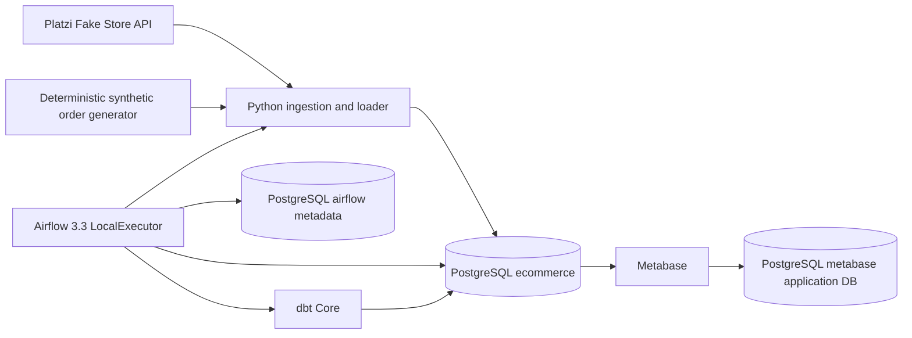

# Current Architecture

> Tài liệu này mô tả **hiện trạng repository**, không phải roadmap. Các mục chưa có SQL/model thực tế được ghi rõ là extension point.

## 1. System context



### Runtime databases

| Database | Consumer | Purpose |
|---|---|---|
| `ecommerce` | ingestion, dbt, Metabase data source | Business/raw/warehouse/BI data |
| `airflow` | Airflow services | DAG metadata, task instances and scheduler state |
| `metabase` | Metabase application | Users, cards, dashboards and application metadata |

Trong Docker network, PostgreSQL được gọi là `postgres`, Airflow metadata database là `airflow-db`. Host ports chỉ bind vào `127.0.0.1`.

## 2. Data flow and orchestration

Daily DAG [`ecommerce_daily_pipeline`](../airflow/dags/ecommerce_daily_pipeline.py:243) chạy lúc `02:00 UTC` với thứ tự:

```text
create_pipeline_run
        |
ingest_source_data
        |
validate_raw_data
        |
generate_orders
        |
dbt_snapshot
        |
dbt_run
        |
dbt_test
        |
record_pipeline_success
```

- `create_pipeline_run` tạo audit row orchestration trong `ops.pipeline_runs`.
- `ingest_source_data` gọi CLI `ingest-platzi`, dùng batch UUID ổn định từ Airflow `run_id`.
- `validate_raw_data` chặn pipeline nếu catalog active rỗng.
- `generate_orders` lấy business date từ `data_interval_start`, fallback sang `logical_date` và UTC hiện tại cho manual context.
- `dbt_snapshot` giữ extension point cho snapshot definitions; thư mục snapshot hiện tại có thể không chứa snapshot SQL nếu project chưa cần SCD model.
- `dbt_run` build staging, warehouse và marts.
- `dbt_test` chạy generic và singular data tests.
- `record_pipeline_success` finalize orchestration audit.

### Audit and idempotency

Có hai loại batch cần phân biệt:

1. **Orchestration batch:** UUID5 từ namespace cố định + `ecommerce_daily_pipeline:<airflow_run_id>`. Đây là một row đại diện cho toàn bộ DAG run.
2. **Ingestion batch:** UUID5 từ namespace cố định + `ecommerce_daily_pipeline:catalog_ingestion:<airflow_run_id>`. Đây là row cho phần ingest catalog.

Retry cùng Airflow `run_id` tạo cùng batch ID. Upsert/reset counters và `ON CONFLICT` giúp retry không nhân bản audit hoặc orders. Order generator và loader cũng dùng order IDs quyết định theo business date/seed để bảo vệ khỏi duplicate.

Nếu một task bị kill trước khi `create_pipeline_run` insert, DAG failure callback [`_mark_dag_failed`](../airflow/dags/ecommerce_daily_pipeline.py:213) gọi finalize với fallback insert/upsert. Nếu update không chạm đúng một row, code ghi log và raise hoặc fallback tùy callback context.

## 3. PostgreSQL layers

```text
raw       -> source-shaped current state + synthetic orders
ops       -> pipeline audit, rejected records, monitoring alerts
staging   -> cleaned and standardized dbt views
snapshots -> reserved dbt snapshot layer
warehouse -> dimensions and order facts
marts     -> BI-facing aggregate tables
```

### Ownership and privileges

| Role | Ownership/access |
|---|---|
| `platform_admin` | PostgreSQL bootstrap administrator (`POSTGRES_ADMIN_USER`) |
| `ingestion_user` | Owns `raw`/`ops`, writes API and order data, writes audit/alerts |
| `dbt_user` | Reads `raw`/`ops`, creates/owns `staging`, `snapshots`, `warehouse`, `marts` |
| `bi_reader` | Read-only access to `marts` and selected monitoring objects |
| `metabase_app` | Owns the separate Metabase application database; not an analytics reader |

Nguyên tắc: Metabase data source dùng `bi_reader`, không dùng database administrator. dbt không cần quyền ghi raw. Ingestion không cần quyền ghi marts.

## 4. dbt architecture

Project [`dbt/ecommerce_dw`](../dbt/ecommerce_dw/dbt_project.yml:1) có ba nhánh model:

### Staging

Các model view chuẩn hóa tên/cast từ raw:

- `stg_categories`: một dòng/category;
- `stg_products`: một dòng/product;
- `stg_users`: một dòng/user;
- `stg_orders`: một dòng/order;
- `stg_order_items`: một dòng/order + line number.

Staging áp dụng accepted values, relationship, not-null, unique và positive-value tests.

### Warehouse

| Model | Grain | Vai trò |
|---|---|---|
| `dim_customers` | một dòng/customer | customer dimension hiện tại |
| `dim_categories` | một dòng/category | category dimension hiện tại |
| `dim_products` | một dòng/product | product dimension hiện tại |
| `fct_orders` | một dòng/order | order facts, amount và quantities |
| `fct_order_items` | một dòng/order + line | line-level facts |

Surrogate keys được tạo deterministic bằng MD5 từ business keys. Fact models join dimensions bằng natural key để giữ traceability về source IDs.

### Marts

| Model | Grain | Metric chính |
|---|---|---|
| `mart_daily_sales` | `ordered_date + currency_code` | order count, line count, quantity, gross/delivered revenue |
| `mart_customer_sales` | `customer_key + currency_code` | customer orders, quantity, gross/delivered revenue |
| `mart_product_sales` | `product_key + currency_code` | units, orders, gross/delivered sales |

`marts` là contract cho BI. Dashboard phải filter `currency_code` trước khi so sánh doanh thu giữa currency.

### Target/schema contract

Macro [`generate_schema_name`](../dbt/ecommerce_dw/macros/generate_schema_name.sql:1) giữ schema ổn định cho production:

| `DBT_TARGET` | Model custom schema `marts` |
|---|---|
| `dev` | `<DBT_SCHEMA>_marts`, ví dụ `dbt_dev_marts` |
| `ci` | `<DBT_SCHEMA>_marts`, tùy schema CI |
| `prod` | `marts` |

Vì Metabase đọc `marts`, local dashboard runtime dùng `DBT_TARGET=prod`. Đây là lý do không nên chạy dbt `dev` rồi kỳ vọng Metabase production contract tự đổi.

## 5. Monitoring and alerting

Monitor DAG [`ecommerce_pipeline_monitor`](../airflow/dags/ecommerce_pipeline_monitor.py:256) chạy mỗi 15 phút. Nó ghi idempotent alerts vào `ops.pipeline_alerts` và có thể gửi Slack/Discord nếu `ALERT_WEBHOOK_URL` được cấu hình.

Các tình trạng được theo dõi:

- không có run nào;
- daily run mới nhất failed;
- run đang chạy quá `MONITOR_RUNNING_TIMEOUT_MINUTES`;
- run thành công quá cũ theo `MONITOR_STALE_AFTER_HOURS`;
- sau `MONITOR_EXPECTED_RUN_HOUR_UTC` + grace period nhưng chưa có daily run mới.

Alert payload chỉ chứa trạng thái/metadata vận hành cần thiết. Webhook URL không được commit.

## 6. Reliability decisions

- **Stable UUID5 batch IDs:** retry-safe audit và ingestion lineage.
- **Database constraints:** status, count, JSON object, positive IDs/prices, no password payload.
- **Explicit row-count validation:** finalize audit không âm thầm thành công khi `UPDATE` không match.
- **Failure callback fallback:** giảm mất audit khi process bị kill trước task insert.
- **Raw validation gate:** không build marts từ catalog trống.
- **Least privilege:** giảm blast radius của lỗi ingestion/dbt/BI.
- **Deterministic synthetic data:** reproducible tests và demo screenshots.
- **Host-only ports:** local service không public ra network ngoài.

## 7. Known boundaries

- Platzi API là nguồn demo bên ngoài; availability và payload có thể thay đổi.
- Metabase cards/dashboards nằm trong application database volume, không được tự động export vào Git. Query contract và dashboard specification được version hóa trong [`dashboards/executive-overview.md`](../dashboards/executive-overview.md).
- `snapshots/` là extension point cho dbt snapshot definitions; nếu thêm SCD2 snapshot, cần thêm SQL/YAML và test trước khi claim history đầy đủ.
- Docker Compose là local/single-node deployment, không phải production HA deployment.
- Synthetic orders không phải dữ liệu người dùng thật và không dùng làm security/compliance evidence.
