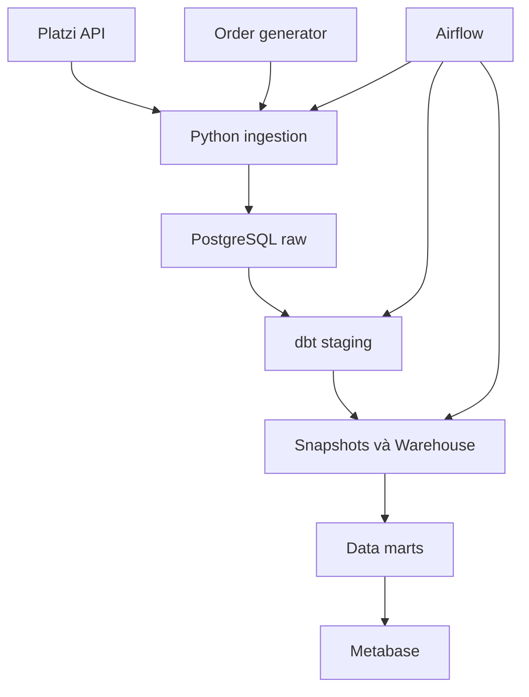
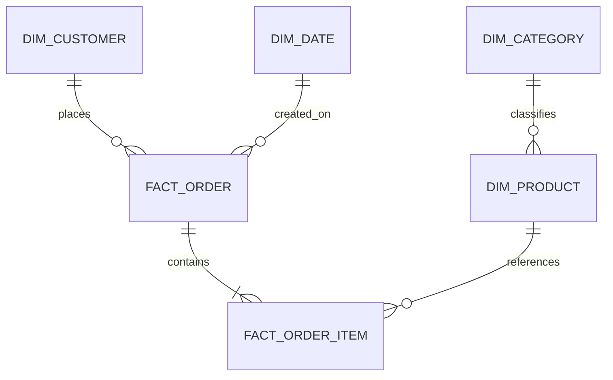
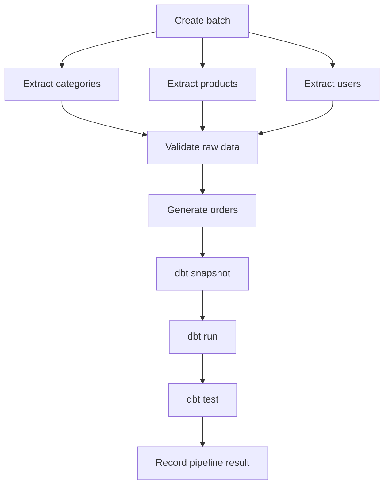

# Kế hoạch toàn diện: E-commerce Data Platform — Design History

> **Design history / target architecture.** Tài liệu này giữ lại các quyết định và mục tiêu ban đầu của project. Nó không phải runbook vận hành và một số tên model/trạng thái có thể khác hiện trạng. Để xem hệ thống đang chạy, dùng [current architecture](current-architecture.md), [data model](data-model.md), [operations runbook](operations-runbook.md) và [`README.md`](../README.md).

## 1. Mục tiêu dự án

Xây dựng một hệ thống Data Engineering dạng batch, có khả năng:

- Thu thập sản phẩm, danh mục và người dùng từ Platzi Fake Store API.
- Tự sinh dữ liệu đơn hàng có tính nhất quán.
- Lưu dữ liệu gốc vào PostgreSQL.
- Làm sạch và xây dựng Data Warehouse bằng dbt.
- Điều phối pipeline bằng Airflow.
- Kiểm tra chất lượng dữ liệu.
- Trực quan hóa kết quả bằng Metabase.
- Chạy toàn bộ hệ thống bằng Docker Compose.

Tên phù hợp để đưa vào CV:

> **E-commerce API-to-Warehouse Data Platform**

## 2. Phạm vi dự án ban đầu

### Chức năng bắt buộc — MVP

- Gọi Platzi API với pagination.
- Thu thập `products`, `categories`, `users`.
- Lưu phản hồi API dưới dạng JSONB.
- Sinh đơn hàng mới mỗi ngày.
- Pipeline chạy lại không tạo dữ liệu trùng.
- Mô hình star schema.
- Theo dõi lịch sử thay đổi giá sản phẩm.
- Airflow tự động chạy pipeline.
- dbt kiểm tra chất lượng dữ liệu.
- Dashboard doanh thu và sản phẩm.
- Docker hóa toàn bộ hệ thống.
- Unit test và CI cơ bản.

### Chưa làm trong phiên bản đầu

- Kafka hoặc streaming.
- Apache Spark.
- Kubernetes.
- Data lake/MinIO.
- Triển khai cloud.
- Machine learning.
- Giao diện website bán hàng.
- Hệ thống thanh toán thật.

Những phần này không cần thiết với một dự án Data Engineer cơ bản.

## 3. Kiến trúc tổng thể



### Công nghệ

| Thành phần | Công nghệ | Mục đích |
|---|---|---|
| Nguồn dữ liệu | Platzi Fake Store API | Sản phẩm, danh mục, người dùng |
| Sinh giao dịch | Python + Faker | Đơn hàng và chi tiết đơn |
| Ingestion | Python, HTTPX, Pydantic | Gọi API, kiểm tra và nạp dữ liệu |
| Lưu trữ | PostgreSQL | Raw data và Data Warehouse |
| Transformation | dbt Core | Làm sạch, mô hình hóa, kiểm thử |
| Orchestration | Apache Airflow | Lập lịch và điều phối |
| Visualization | Metabase | Dashboard |
| Môi trường | Docker Compose | Khởi động hệ thống đồng nhất |
| Kiểm thử | pytest + dbt tests | Kiểm tra code và dữ liệu |
| CI | GitHub Actions | Chạy test tự động |

Platzi hỗ trợ pagination `offset/limit`, CRUD và JWT. Tuy nhiên dự án chỉ dùng `GET`, tránh thay đổi dữ liệu công khai.

Airflow sẽ dùng `LocalExecutor`, phù hợp với hệ thống nhỏ chạy trên một máy và nhẹ hơn kiến trúc Celery/Redis.

## 4. Nguồn dữ liệu

### 4.1. Platzi API

Các endpoint:

```text
GET /api/v1/products?offset=0&limit=20
GET /api/v1/categories
GET /api/v1/users
```

Dữ liệu chính:

| Entity | Trường sử dụng |
|---|---|
| Product | `id`, `title`, `price`, `description`, `category`, `creationAt`, `updatedAt` |
| Category | `id`, `name`, `slug` |
| User | `id`, `name`, `email`, `role`, `creationAt`, `updatedAt` |

Không lưu các trường như password hoặc token, dù đây là dữ liệu giả.

### 4.2. Order generator

Platzi không cung cấp hệ thống đơn hàng hoàn chỉnh nên Python sẽ sinh:

#### Order

```text
order_id
customer_id
order_status
payment_method
order_created_at
currency
```

#### Order item

```text
order_item_id
order_id
product_id
quantity
unit_price
discount_amount
line_amount
```

Phân bố dự kiến:

- 50–200 đơn hàng/ngày.
- 1–5 sản phẩm/đơn.
- Số lượng mỗi sản phẩm từ 1–3.
- Khoảng 80% hoàn thành.
- 8% đang xử lý.
- 7% hủy.
- 5% hoàn tiền.

Đây chỉ là cấu hình, có thể thay đổi sau.

### Sinh dữ liệu có tính quyết định

Generator sẽ dùng ngày chạy làm seed:

```python
random.seed("2026-07-27")
```

Nếu pipeline ngày 27/07 được chạy lại, nó phải tạo đúng các `order_id` cũ. PostgreSQL bỏ qua bản ghi đã có, nhờ đó pipeline có tính **idempotent**.

## 5. Chiến lược lưu trữ

Một PostgreSQL container, nhưng chia thành các database/schema riêng.

### Database

```text
airflow_metadata
ecommerce_dw
metabase_metadata
```

### Schema trong `ecommerce_dw`

```text
raw
staging
snapshots
warehouse
marts
ops
```

| Schema | Công dụng |
|---|---|
| `raw` | Lưu dữ liệu gần giống nguồn |
| `staging` | Chuẩn hóa kiểu dữ liệu và tên cột |
| `snapshots` | Lịch sử thay đổi dữ liệu |
| `warehouse` | Dimension và fact tables |
| `marts` | Bảng tổng hợp cho dashboard |
| `ops` | Theo dõi pipeline và bản ghi lỗi |

PostgreSQL `JSONB` phù hợp để lưu phản hồi API có cấu trúc lồng nhau và vẫn cho phép truy vấn các trường bên trong.

## 6. Thiết kế raw layer

### `raw.api_responses`

Lưu nguyên phản hồi từng trang API:

```text
response_id
batch_id
entity_name
endpoint
page_offset
status_code
fetched_at
payload JSONB
payload_hash
```

### `raw.products`

```text
source_product_id
batch_id
raw_data JSONB
record_hash
source_created_at
source_updated_at
ingested_at
```

Khóa duy nhất:

```text
(source_product_id, batch_id)
```

Tương tự cho:

```text
raw.categories
raw.users
raw.orders
raw.order_items
```

### `ops.rejected_records`

Dữ liệu lỗi không bị bỏ im lặng mà được chuyển vào:

```text
rejected_id
batch_id
entity_name
raw_data
error_reason
rejected_at
```

## 7. Chiến lược incremental loading

Platzi không có endpoint đáng tin cậy kiểu:

```text
?updated_after=...
```

Vì vậy không nên giả vờ rằng API hỗ trợ incremental extraction.

### Products, users và categories

Mỗi lần chạy:

1. Lấy toàn bộ dữ liệu theo từng trang.
2. Tính `record_hash`.
3. Lưu snapshot gắn với `batch_id`.
4. So sánh với snapshot trước.
5. Chỉ cập nhật warehouse khi dữ liệu thay đổi.

Do dữ liệu Platzi nhỏ nên full extraction là hợp lý.

### Orders

Orders là append-only:

- Chỉ sinh dữ liệu cho ngày chạy.
- `order_id` có tính quyết định.
- Dùng `ON CONFLICT DO NOTHING` hoặc upsert.
- Chạy lại không tạo bản ghi trùng.

### dbt incremental models

Các bảng fact sẽ dùng `materialized='incremental'` và `unique_key`. dbt chỉ xử lý các bản ghi mới hoặc đã thay đổi thay vì xây lại toàn bộ bảng.

## 8. Mô hình Data Warehouse



### Dimension tables

#### `warehouse.dim_customer`

```text
customer_key
source_customer_id
customer_name
email
role
valid_from
valid_to
is_current
```

#### `warehouse.dim_category`

```text
category_key
source_category_id
category_name
category_slug
```

#### `warehouse.dim_product`

```text
product_key
source_product_id
product_title
category_key
price
valid_from
valid_to
is_current
```

#### `warehouse.dim_date`

```text
date_key
full_date
day
month
quarter
year
day_of_week
is_weekend
```

### Fact tables

#### `warehouse.fact_orders`

```text
order_key
source_order_id
customer_key
order_date_key
status
payment_method
currency
gross_amount
discount_amount
net_amount
```

#### `warehouse.fact_order_items`

```text
order_item_key
order_key
product_key
quantity
unit_price
discount_amount
line_amount
```

`unit_price` phải được lưu tại thời điểm mua. Không lấy giá hiện tại của sản phẩm để tính lại đơn hàng cũ.

## 9. Theo dõi lịch sử giá — SCD Type 2

Ví dụ giá sản phẩm thay đổi:

| product_id | price | valid_from | valid_to | is_current |
|---:|---:|---|---|---|
| 15 | 100 | 2026-07-20 | 2026-07-26 | false |
| 15 | 120 | 2026-07-27 | null | true |

Dự án sẽ dùng dbt snapshot với chiến lược kiểm tra các cột:

```text
title
price
category_id
description
```

Không hoàn toàn phụ thuộc vào `updatedAt`, vì dữ liệu công khai có thể thay đổi không chuẩn.

## 10. Thiết kế Airflow DAG

Tên DAG:

```text
ecommerce_daily_pipeline
```

Lịch dự kiến:

```text
02:00 mỗi ngày
```

Luồng task:



Cấu hình:

```text
retries: 2
retry_delay: 5 phút
max_active_runs: 1
catchup: false ở phiên bản đầu
```

Khi đã ổn định, có thể hỗ trợ backfill theo logical date.

## 11. Kiểm tra chất lượng dữ liệu

### Kiểm tra source và staging

- ID không được null.
- ID không được trùng trong cùng batch.
- `price >= 0`.
- Email đúng định dạng cơ bản.
- Category của product phải tồn tại.
- API phải trả về JSON hợp lệ.
- Tổng số bản ghi không được bằng 0.

### Kiểm tra warehouse

- Khóa chính duy nhất.
- Foreign key hợp lệ.
- `quantity > 0`.
- `unit_price >= 0`.
- `line_amount` đúng công thức.
- Tổng order bằng tổng order items.
- `is_current = true` chỉ có một bản ghi cho mỗi sản phẩm.
- Status chỉ thuộc:

```text
pending
completed
cancelled
refunded
```

### Source freshness

Pipeline cảnh báo nếu dữ liệu catalog không được cập nhật trong khoảng thời gian cấu hình.

## 12. Xử lý lỗi

| Trường hợp | Cách xử lý |
|---|---|
| API timeout | Retry với exponential backoff |
| HTTP 500/503 | Retry |
| HTTP 400/404 | Không retry vô hạn, ghi lỗi |
| JSON sai cấu trúc | Đưa vào `rejected_records` |
| Product không có category | Gắn `unknown_category` hoặc cách ly |
| Product bị xóa giữa pipeline | Không làm hỏng fact cũ |
| dbt test thất bại | Dừng pipeline trước dashboard |
| Pipeline chạy lại | Upsert hoặc bỏ qua bản ghi đã có |
| API trả quá nhiều trang | Có giới hạn số trang an toàn |

Không dùng `POST`, `PUT` hoặc `DELETE` lên Platzi API.

## 13. Observability

### `ops.pipeline_runs`

```text
pipeline_run_id
dag_id
batch_id
logical_date
started_at
finished_at
status
products_extracted
users_extracted
orders_generated
records_rejected
error_message
```

Airflow log cần thể hiện:

```text
batch_id=20260727T020000
entity=products
page=3
records_received=20
records_loaded=20
records_rejected=0
duration_ms=520
```

Không ghi password, token hoặc toàn bộ thông tin người dùng vào log.

## 14. Dashboard Metabase

### Dashboard 1: Executive Overview

- Tổng doanh thu.
- Tổng số đơn hàng.
- Average Order Value.
- Số khách hàng.
- Tỷ lệ hủy và hoàn tiền.
- Doanh thu theo ngày.

### Dashboard 2: Product Performance

- Top sản phẩm theo doanh thu.
- Top category.
- Số lượng sản phẩm bán ra.
- Biến động giá sản phẩm.
- Doanh thu theo khoảng giá.

### Dashboard 3: Customer Analysis

- Khách hàng mới.
- Khách hàng quay lại.
- Doanh thu trung bình mỗi khách hàng.
- Top khách hàng.
- Phương thức thanh toán phổ biến.

### Dashboard 4: Pipeline Health — tùy chọn

- Số bản ghi mỗi lần chạy.
- Số bản ghi bị loại.
- Thời gian chạy pipeline.
- Trạng thái các lần chạy gần nhất.

## 15. Cấu trúc repository

```text
ecommerce-data-platform/
├── airflow/
│   └── dags/
│       └── ecommerce_daily_pipeline.py
├── src/
│   └── ecommerce_pipeline/
│       ├── api_client.py
│       ├── extractors.py
│       ├── validators.py
│       ├── loaders.py
│       ├── order_generator.py
│       ├── models.py
│       └── config.py
├── dbt/
│   └── ecommerce_dw/
│       ├── models/
│       │   ├── staging/
│       │   ├── intermediate/
│       │   ├── warehouse/
│       │   └── marts/
│       ├── snapshots/
│       ├── tests/
│       └── dbt_project.yml
├── sql/
│   └── init/
├── tests/
│   ├── unit/
│   ├── integration/
│   └── fixtures/
├── docs/
│   ├── architecture.md
│   ├── data_model.md
│   └── data_dictionary.md
├── dashboards/
├── docker-compose.yml
├── Dockerfile
├── pyproject.toml
├── Makefile
├── .env.example
├── .gitignore
└── README.md
```

## 16. Chiến lược kiểm thử

### Unit tests

- Pagination dừng đúng lúc.
- Retry đúng số lần.
- API trả dữ liệu lỗi.
- Pydantic từ chối record sai.
- Order generator tạo kết quả giống nhau khi cùng ngày.
- Không sinh `order_id` trùng.
- Tính `line_amount` chính xác.

### Integration tests

- Nạp fixture JSON vào PostgreSQL.
- Chạy lại ingestion hai lần không bị trùng.
- dbt tạo thành công dimensions và facts.
- Sản phẩm đổi giá tạo phiên bản SCD mới.

### CI

Mỗi lần push lên GitHub:

1. Kiểm tra format/lint.
2. Chạy pytest.
3. Chạy `dbt compile`.
4. Khởi tạo PostgreSQL test.
5. Chạy `dbt build` trên fixture data.

CI không gọi Platzi API trực tiếp để tránh test thất bại do mạng hoặc API tạm ngừng.

## 17. Tối ưu tài nguyên laptop

Airflow, Metabase và PostgreSQL cùng chạy có thể tương đối nặng. Thiết kế sẽ dùng:

- Airflow `LocalExecutor`.
- Không dùng Celery và Redis.
- Giới hạn concurrency.
- Không bật Spark/Kafka.
- Docker Compose profiles:

```text
core          PostgreSQL
orchestration Airflow
bi            Metabase
```

Khi phát triển ingestion, chỉ bật PostgreSQL. Chỉ bật Metabase khi làm dashboard.

## 18. Rủi ro chính

| Rủi ro | Biện pháp |
|---|---|
| Platzi bị gián đoạn | Retry, fixture và raw snapshot |
| Dữ liệu bị người khác sửa | Hash record và SCD Type 2 |
| Dữ liệu bị xóa | Giữ lịch sử trong warehouse |
| API chứa record rác | Validation và rejected table |
| Đơn hàng là dữ liệu giả | Ghi rõ trong README |
| Dữ liệu quá ít | Backfill 90–180 ngày đơn hàng |
| Docker quá nặng | Compose profiles và LocalExecutor |
| Pipeline tạo dữ liệu khác khi retry | Seed theo logical date |
| Dashboard tính sai doanh thu | dbt test tổng order và order items |

## 19. Các giai đoạn triển khai

| Giai đoạn | Nội dung | Điều kiện hoàn thành |
|---|---|---|
| 0 | Chuẩn bị môi trường và repository | Docker, Python, Git hoạt động |
| 1 | PostgreSQL và raw schemas | Database khởi động, migration chạy được |
| 2 | Platzi API ingestion | Lấy đủ products/categories/users có pagination |
| 3 | Order generator | Sinh đơn hàng nhất quán, không trùng |
| 4 | dbt staging | Dữ liệu được làm sạch và kiểm thử |
| 5 | Warehouse và SCD2 | Dimensions, facts, lịch sử giá hoạt động |
| 6 | Airflow | DAG tự động chạy end-to-end |
| 7 | Metabase | Ba dashboard chính hoàn thiện |
| 8 | Tests và CI | pytest/dbt build chạy thành công |
| 9 | README và demo | Người khác có thể chạy theo hướng dẫn |

### Thời gian dự kiến

Khoảng 20–30 giờ:

- Nền tảng và database: 3–4 giờ.
- API ingestion: 4–5 giờ.
- Order generator: 2–3 giờ.
- dbt và Data Warehouse: 6–8 giờ.
- Airflow: 3–4 giờ.
- Dashboard: 2–3 giờ.
- Test, CI và README: 3–5 giờ.

## 20. Tiêu chí dự án hoàn thành

Dự án chỉ được coi là hoàn thành khi:

- Có thể khởi động bằng Docker Compose.
- Pipeline lấy dữ liệu API theo pagination.
- Airflow chạy end-to-end thành công.
- Chạy lại cùng ngày không sinh dữ liệu trùng.
- Giá sản phẩm thay đổi được lưu lịch sử.
- Tất cả dbt tests vượt qua.
- Dashboard sử dụng bảng marts, không truy vấn raw tables.
- Có unit test cho API client và generator.
- CI chạy thành công.
- README có kiến trúc, data model và hướng dẫn chạy.
- Có ảnh Airflow DAG, dbt tests và dashboard.
- Có video demo 2–3 phút.

## 21. Tài liệu tham khảo

- [Platzi Fake Store API](https://fakeapi.platzi.com/)
- [Platzi Products API](https://fakeapi.platzi.com/en/rest/products/)
- [Apache Airflow: Executors](https://airflow.apache.org/docs/apache-airflow/stable/core-concepts/executor/index.html)
- [Apache Airflow: Running in Docker](https://airflow.apache.org/docs/apache-airflow/stable/howto/docker-compose/index.html)
- [dbt: Incremental models](https://docs.getdbt.com/docs/build/incremental-models)
- [dbt: Incremental strategy](https://docs.getdbt.com/docs/build/incremental-strategy)
- [PostgreSQL: JSON types](https://www.postgresql.org/docs/current/datatype-json.html)
- [Metabase: Running on Docker](https://www.metabase.com/docs/latest/installation-and-operation/running-metabase-on-docker)

## 22. Bước tiếp theo

Bắt đầu **Giai đoạn 0: kiểm tra môi trường, tạo repository và khung thư mục**, sau đó mới dựng PostgreSQL.
